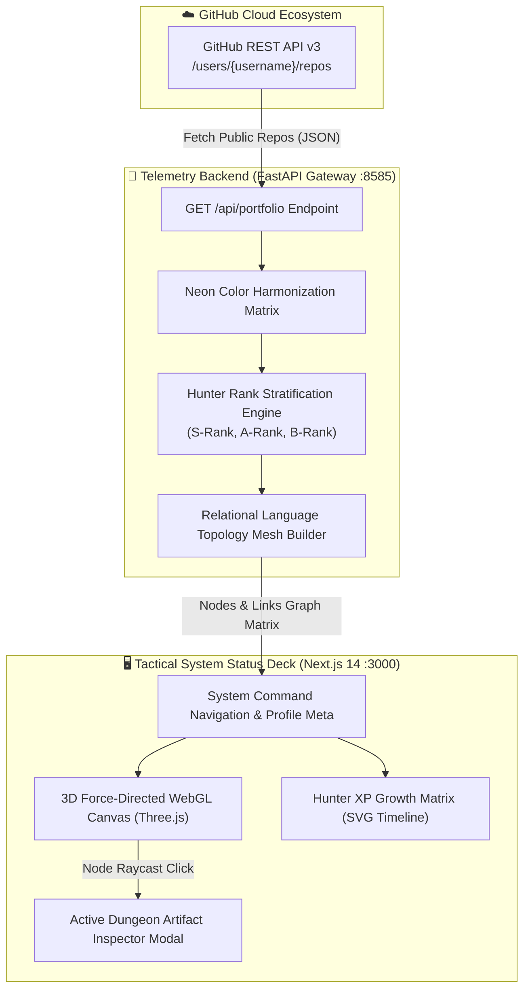
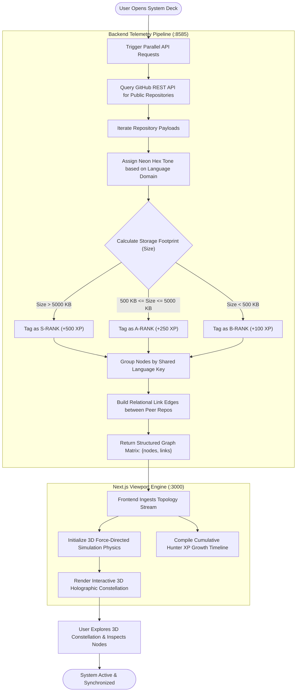
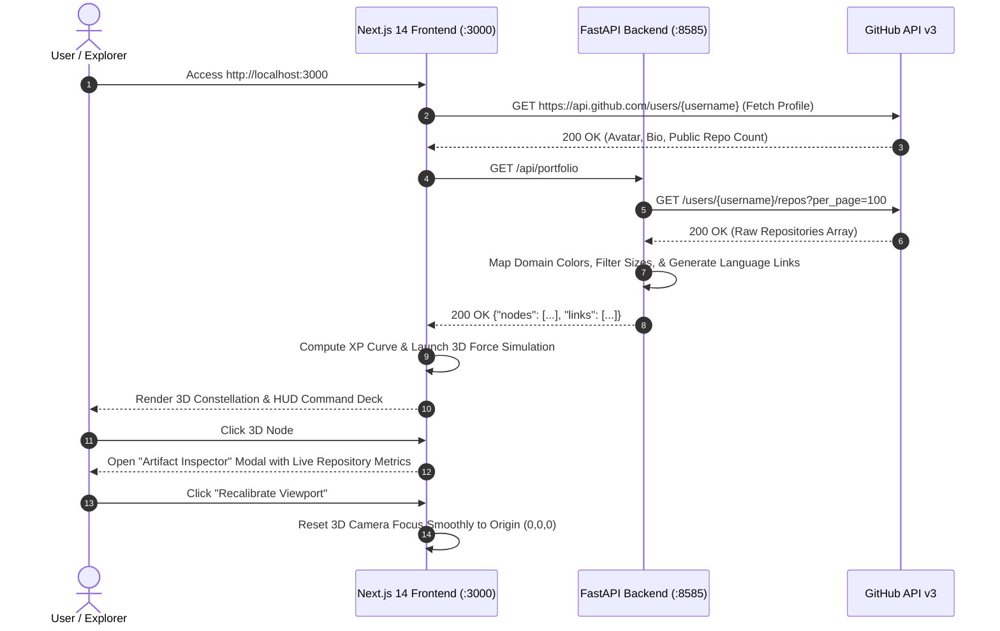

# 🌌 Git-Awakening: 3D Holographic Constellation Matrix & Telemetry Deck

[](https://github.com/kailash6207)
[](https://nextjs.org/)
[](https://reactjs.org/)
[](https://fastapi.tiangolo.com/)
[](https://threejs.org/)
[](https://www.python.org/)
[](LICENSE)

> **[ RANK: MASTER INFRASTRUCTURE CONSTELLATION ]**  
> An interactive, real-time 3D network topology map and tactical engineering engine designed to project GitHub repository telemetry vectors, language composition matrices, dimensional dungeon rank tiers, and live Hunter XP progression over a unified cyberpunk system status deck interface.

---

## 📑 Table of Contents
- [🚀 Key Features](#-key-features)
- [🏗️ System Architecture](#️-system-architecture)
- [🔄 Processing Workflow & Diagrams](#-processing-workflow--diagrams)
  - [1. Data Extraction & Constellation Flowchart](#1-data-extraction--constellation-flowchart)
  - [2. Interactive Viewport Sequence](#2-interactive-viewport-sequence)
  - [3. Deep-Dive Workflow & Stratification Math](#3-deep-dive-workflow--stratification-math)
- [🛠️ Tech Stack](#️-tech-stack)
- [🔌 API Reference](#-api-reference)
- [📂 Project Structure](#-project-structure)
- [💻 Quickstart & Deployment](#-quickstart--deployment)
  - [Prerequisites](#prerequisites)
  - [1. Start the Telemetry Backend](#1-start-the-telemetry-backend)
  - [2. Start the Next.js Viewport](#2-start-the-nextjs-viewport)
- [🎮 Tactical Controls](#-tactical-controls)
- [🤝 Contributing](#-contributing)
- [📜 License](#-license)

---

## 🚀 Key Features

* **🌌 3D Force-Directed Constellation Matrix:** Physics-driven 3D particle and mesh graph grouping repositories dynamically based on shared technology cores into interconnected celestial star clusters.
* **👑 Hunter Rank Tier Stratification:** Automatically evaluates codebase footprints and classifies repositories into hierarchical dungeon rank layers:
  * 🔴 **S-Rank Peak Layer:** Complex, flagship architecture codebases ($>5000\text{ KB}$, $+500\text{ XP}$)
  * 🟡 **A-Rank Mid Layer:** Elite production-grade systems ($500\text{ KB} - 5000\text{ KB}$, $+250\text{ XP}$)
  * 🔵 **B-Rank Base Layer:** Specialized utility tools and micro-modules ($<500\text{ KB}$, $+100\text{ XP}$)
* **📈 Real-Time Hunter XP Growth Curve:** Dynamic SVG trendline visualization plotting cumulative developer milestones and experience progression over chronological repository history.
* **🎨 Neon Domain Harmonization:** Automatically color-codes nodes based on technological domains (Cyan for Python, Amber for JavaScript/TypeScript, Purple for Java/Kotlin, Crimson for Frontend/HTML, Emerald for Systems).
* **🎯 Tactical HUD & Node Inspector:** Interactive raycasting selector on 3D nodes to inspect repository descriptions, live star counts, watcher metrics, and direct GitHub links.
* **🧭 Instant Camera Recalibration:** Single-click viewport alignment matrix to snap the 3D camera smoothly back to the central coordinate origin.
* **🚀 High-Throughput FastAPI Engine:** Async Python backend that aggregates, cleanses, and transforms GitHub REST API v3 payloads into force-directed node-link graph matrices.

---

## 🏗️ System Architecture



---

## 🔄 Processing Workflow & Diagrams

### 1. Data Extraction & Constellation Flowchart



---

### 2. Interactive Viewport Sequence



---

### 3. Deep-Dive Workflow & Stratification Math

#### Phase 1: Dynamic Telemetry Ingestion
The FastAPI core queries the public GitHub endpoint:
$$\text{Endpoint} = \text{https://api.github.com/users/kailash6207/repos?per_page=100\&sort=created}$$
Each payload is parsed into individual atomic node vectors with metadata: `id`, `label`, `description`, `language`, `stars`, `watchers`, `size`, and `created_at`.

#### Phase 2: Relational Topology Meshing
To convert disjointed project nodes into a cohesive constellation galaxy:
1. Repositories sharing identical programming language ecosystems are grouped into buckets:
   $$\mathcal{G}_{\text{lang}} = \{ \text{repo}_1, \text{repo}_2, \dots, \text{repo}_m \}$$
2. Sequential interconnecting link edges are synthesized between neighboring repos in $\mathcal{G}_{\text{lang}}$:
   $$\mathcal{E}_{\text{links}} = \{ (\text{repo}_i, \text{repo}_{i+1}) \mid 1 \le i < m \}$$
3. Repositories with custom names (`lockup`, `xfinance`, `guardian`) trigger thematic neon accents.

#### Phase 3: Hunter Rank Stratification & XP Accumulation
The system calculates a developer's cumulative mastery score through chronological repository growth:
$$\text{XP}_{\text{total}} = \sum_{i=1}^{N} \Delta \text{XP}(i), \quad \text{where} \quad \Delta \text{XP} = \begin{cases} 500 & \text{if } \text{Size} > 5000\text{ KB (S-Rank)} \\ 250 & \text{if } 500\text{ KB} \le \text{Size} \le 5000\text{ KB (A-Rank)} \\ 100 & \text{if } \text{Size} < 500\text{ KB (B-Rank)} \end{cases}$$

---

## 🛠️ Tech Stack

| Layer | Technology | Purpose |
| :--- | :--- | :--- |
| **Frontend Framework** | Next.js 14, React 18 | High-performance React web application with SSR/CSR |
| **3D Graphics Engine** | Three.js & 3D Force Graph | WebGL particle physics, coordinate rendering & raycasting |
| **Icons & UI** | React-Icons (FontAwesome 6) | Tactical cyberpunk status badges and HUD icons |
| **Backend API** | FastAPI (Python 3.10+) | High-throughput asynchronous REST API distribution core |
| **Server Gateway** | Uvicorn | ASGI server handling telemetry serialization |
| **HTTP Client** | Requests | Python client for GitHub REST API v3 queries |

---

## 🔌 API Reference

### 1. Retrieve Portfolio Constellation Graph
`GET /api/portfolio`  
Compiles all public repositories into a force-directed node-and-link graph matrix.

* **Query Parameters:** `username` (optional, default: `kailash6207`)
* **Response (200 OK):**
```json
{
  "nodes": [
    {
      "id": "https://github.com/kailash6207/GoRaft-KV",
      "label": "GoRaft-KV",
      "description": "A fault-tolerant distributed Key-Value store in Go...",
      "language": "Go",
      "color": "#22c55e",
      "stars": 4,
      "watchers": 4,
      "size": 2500,
      "created_at": "2024-08-15T10:30:00Z"
    }
  ],
  "links": [
    {
      "source": "https://github.com/kailash6207/GoRaft-KV",
      "target": "https://github.com/kailash6207/maze-x"
    }
  ]
}
```

---

### 2. Backend Health Check
`GET /`  
Returns gateway operational status.

* **Response (200 OK):**
```json
{
  "status": "ONLINE",
  "system": "Solo Leveling Core Matrix Gateway Active"
}
```

---

## 📂 Project Structure

```
git-awakening/
├── backend/                           # Telemetry Processing Core
│   ├── main.py                        # Primary FastAPI distribution gateway (:8080)
│   ├── portfolio_backend.py           # Alternate portfolio aggregation service (:8585)
│   └── requirements.txt               # Backend Python dependencies
├── frontend/                          # Next.js Viewport Environment
│   ├── package.json                   # Node scripts & dependencies
│   ├── pages/
│   │   └── index.js                   # Primary tactical HUD status deck interface
│   └── components/
│       └── GitVisualizer.js           # 3D WebGL Force-directed arena component
├── .gitignore                         # Build and dependency isolation rules
└── README.md                          # Comprehensive documentation
```

---

## 💻 Quickstart & Deployment

### Prerequisites
- **Node.js 18+ & npm**
- **Python 3.10+** & `pip`

---

### 1. Start the Telemetry Backend

```bash
# 1. Navigate to the backend directory
cd backend

# 2. Create and activate a virtual environment
python -m venv venv
# Windows:
.\venv\Scripts\activate
# Linux / macOS:
source venv/bin/activate

# 3. Install dependencies
pip install fastapi uvicorn requests

# 4. Launch the telemetry core (Port 8585)
python portfolio_backend.py
```
> Telemetry Gateway running live at: `http://localhost:8585`

---

### 2. Start the Next.js Viewport

```bash
# 1. Open a new terminal and navigate to frontend directory
cd frontend

# 2. Install dependencies
npm install

# 3. Launch the development server
npm run dev
```
> System Deck automatically launches at: `http://localhost:3000`

---

## 🎮 Tactical Controls

| Control | Action |
| :--- | :--- |
| **Left Click + Drag** | Orbit and rotate the 3D camera across celestial axes |
| **Right Click + Drag** | Pan the camera laterally across the dimensional plane |
| **Scroll Wheel** | Zoom into targeted repository star clusters |
| **Click Node** | Open the **Active Dungeon Artifact** inspector modal |
| **Recalibrate Button** | Smoothly snap camera focus back to origin `(0,0,0)` |

---

## 🤝 Contributing

Contributions, issues, and tactical feature requests are welcome!
1. Fork the Project (`git checkout -b feature/NewDimension`)
2. Commit your Changes (`git commit -m 'feat: Add NewDimension'`)
3. Push to the Branch (`git push origin feature/NewDimension`)
4. Open a Pull Request

---

## 📜 License

Distributed under the **MIT License**. See `LICENSE` for details.

---

<div align="center">
  <sub>Engineered with ⚡ by <a href="https://github.com/kailash6207">Kailash N H</a></sub>
</div>
